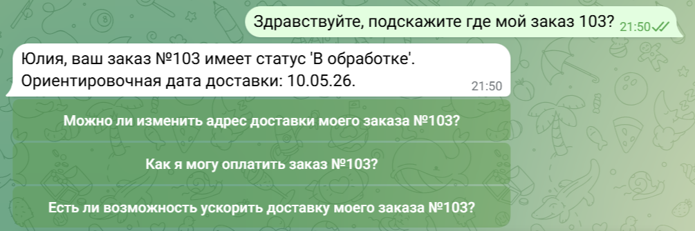

# Кейс №3: ИИ-ассистент техподдержки с интеграцией Google Sheets

### Описание проекта
Разработка интеллектуального бота для Telegram, который в реальном времени проверяет статус заказа клиента в базе данных (Google Таблицы). Бот не просто отвечает на вопросы, но и выполняет функции сотрудника техподдержки.

### Реализованный функционал
* **Автоматизация поиска**: Бот принимает номер заказа, обращается к Google Таблице и находит актуальную информацию.
* **Python-логика**: Написан кастомный скрипт для обработки данных из таблицы, что позволило избежать ошибок при поиске и сопоставлении ID.
* **Персонализация**: Система автоматически определяет имя клиента по базе и использует его в ответе.
* **Интерактивность**: Подключены быстрые кнопки (Follow-up) для удобства пользователя.

### Технический стек
Coze, Python, Google Sheets API, Telegram Bot API.

### Результат работы

