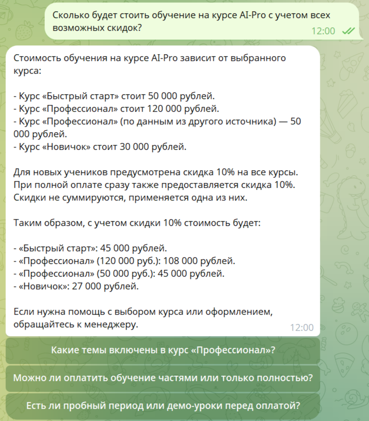
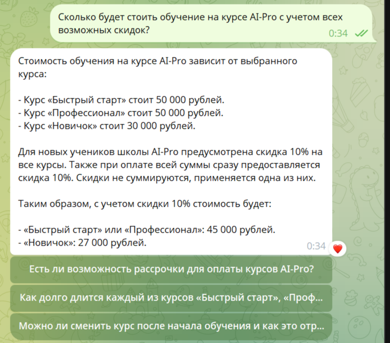
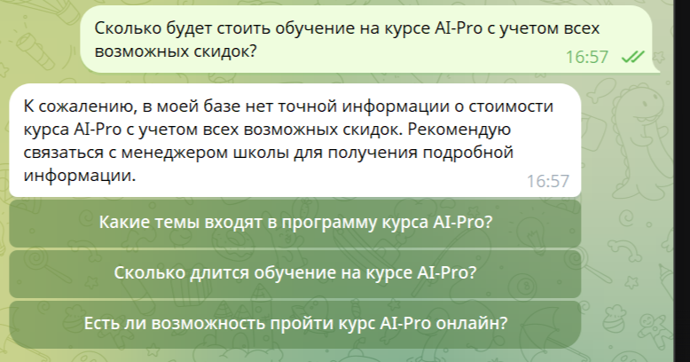

# RAG-Precision-Customer-Support
Оптимизация RAG-системы: контроль галлюцинаций и очистка UX в AI-агенте

# Оптимизация RAG-системы и контроль качества ответов (Кейс №2)

Проект посвящен глубокой настройке логики ИИ-агента для онлайн-школы. Основной упор сделан на безопасность данных и чистоту пользовательского опыта (UX).

### 🛠 Проблема
На старте система выдавала "грязные" ответы: транслировала технические расчеты (например, 50,000 - 10%), упоминала названия внутренних блоков данных и пыталась использовать внешние знания модели для ответа на специфические вопросы о скидках.

*Рис 1. Пример галлюцинации цены и вывода технических метаданных.*

### 🚀 Реализованные решения

* **Knowledge Cutoff (Отсечка знаний)**: Внедрен запрет на использование внутренних данных модели. Теперь бот отвечает строго на базе предоставленных файлов.
* **Negative Constraints (Негативные ограничения)**: Добавлены инструкции по удалению технического "мусора" (JSON-скобок) и ссылок на источники данных.
* **Autonomous Calculation**: Настроена логика скрытых вычислений. Бот сам рассчитывает скидки из разных файлов и выдает только итоговую сумму.
* **Precise Mode**: Настроена температура модели (Temperature ≈ 0) для получения детерминированных и строгих ответов.

### 📊 Сравнение результатов

| Характеристика | До оптимизации | После оптимизации |
| :--- | :--- | :--- |
| **Формат ответа** | Технический текст со скобками и расчетами | Чистый, лаконичный текст |
| **Риск галлюцинаций** | Высокий (модель додумывает скидки) | Минимальный (строгая отсечка по базе) |
| **Математика** | Демонстрация процесса (50-10%) | Выдача финальной суммы |
### Визуальный результат оптимизации:

*Рис 2. Идеальный UX: автоматический расчет и отсутствие "шума".*

*Рис 3. Безопасный отказ при отсутствии данных в базе.*
